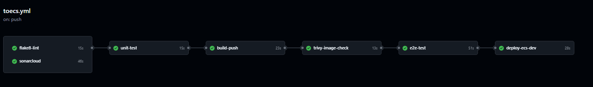

# GitHub Actions Workflow Documentation: Container Deployment to AWS ECS Fargate

## Overview
This GitHub Actions workflow automates the process of linting, running unit tests, building a Docker image, scanning for vulnerabilities, executing end-to-end (E2E) tests, and deploying the container to AWS ECS Fargate upon changes to the `main` branch. It ensures code quality and security checks are conducted prior to deployment.

## Prerequisites
- This GitHub repository.
- Docker Hub account with `DOCKER_USERNAME` and `DOCKER_PASS` secrets set in the repository.
- AWS account with `AWS_ACCESS_KEY_ID`, `AWS_SECRET_ACCESS_KEY`, and `AWS_REGION` secrets configured in the repository. This account must have the following permissions:
   - ecs:DescribeTaskDefinition
   - ecs:RegisterTaskDefinition
   - ecs:UpdateService
   - ecs:DeregisterTaskDefinition
   - ecs:DescribeServices
   - iam:PassRole
   - logs:CreateLogStream
   - logs:PutLogEvents
- AWS ECS cluster created and working. You could use my cloudformation templates available at [CloudFormation Snippets](https://github.com/lroquec/cfn-snippets.git)
- SonarCloud account for code analysis with `SONAR_TOKEN` set as a secret.

## Detailed Explanation

### Workflow Triggers
The workflow is triggered by:
- A push to the `main` branch.
- Opening or synchronizing a pull request targeting the `main` branch.
- Manual dispatch through `workflow_dispatch`.

### Workflow Structure

1. **Concurrency**
   - Ensures only one workflow runs per branch at a time, canceling any in-progress workflow if a new one starts.

2. **Environment Variables**
   - Uses GitHub secrets for Docker credentials (`DOCKER_PASS` and `DOCKER_USERNAME`) and application image name.

### Jobs

#### 1. `flake8-lint`
- **Purpose**: Run linting checks using `flake8` to maintain code quality.
- **Steps**:
  - Checkout the source code.
  - Set up Python (version 3.13).
  - Run `flake8` for linting.

#### 2. `sonarcloud`
- **Purpose**: Perform code analysis using SonarCloud.
- **Steps**:
  - Checkout the code with full depth for comprehensive analysis.
  - Run SonarCloud analysis using the `SONAR_TOKEN`.

#### 3. `unit-test`
- **Dependencies**: Requires successful completion of `flake8-lint` and `sonarcloud`.
- **Purpose**: Run unit tests to validate code functionality.
- **Steps**:
  - Checkout the code and set up Python (version 3.13) with `pip` caching.
  - Install dependencies and run unit tests with `unittest`.

#### 4. `build-push`
- **Dependencies**: Runs after `unit-test`.
- **Purpose**: Build and push a Docker image to Docker Hub for testing.
- **Steps**:
  - Set up QEMU for cross-platform builds.
  - Set up Docker Buildx.
  - Login to Docker Hub.
  - Build and push the Docker image with a `:test` tag.

#### 5. `trivy-image-check`
- **Dependencies**: Runs after `build-push`.
- **Purpose**: Scan the Docker image for vulnerabilities using Trivy.
- **Steps**:
  - Download and install Trivy.
  - Run a vulnerability scan and output results in SARIF format.
  - Upload scan results as an artifact.

#### 6. `e2e-test`
- **Dependencies**: Runs after `trivy-image-check`.
- **Purpose**: Perform E2E tests using Selenium to ensure application behavior meets expectations.
- **Container Setup**:
  - Run `selenium/standalone-chrome` for browser-based tests.
  - Deploy the app container with health checks configured.
- **Steps**:
  - Checkout the code.
  - Install `selenium` and `pytest`.
  - Run the E2E tests and generate a report.
  - Upload test results as an artifact.

#### 7. `deploy`
- **Condition**: Runs only on `push` events.
- **Dependencies**: Runs after `e2e-test`.
- **Purpose**: Deploy the Docker image to AWS ECS.
- **Steps**:
  - Checkout the code.
  - Set up QEMU and Docker Buildx.
  - Login to Docker Hub and build the Docker image with the current commit SHA.
  - Configure AWS credentials.
  - Obtain the current ECS task definition, modify it with the new image tag, and register the updated task definition.
  - Update the ECS service with the new task definition to complete the deployment.

This workflow ensures a comprehensive CI/CD pipeline, incorporating code linting, unit testing, vulnerability scanning, E2E testing, and automated deployment, making it robust for production use.

